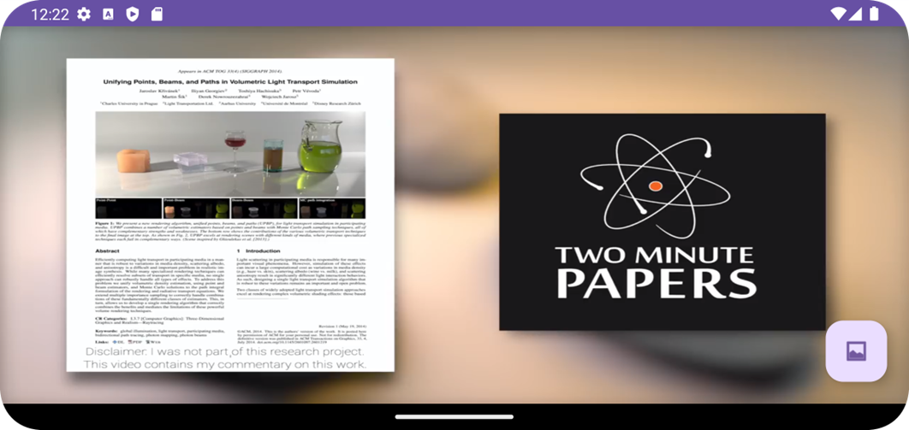
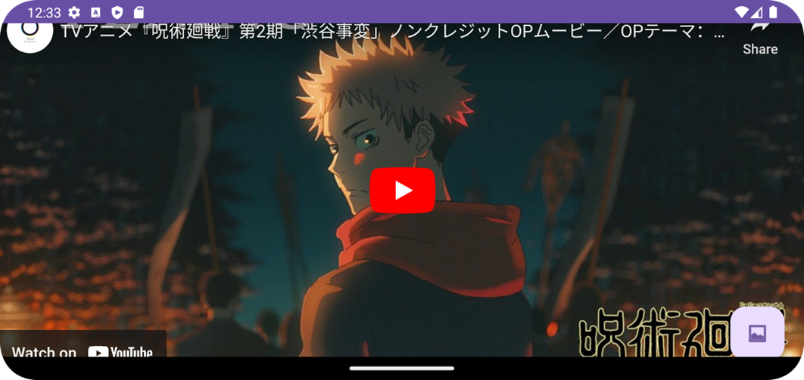

# P7_21012011046 - Video Player and YouTube Player Application

## Submitted By
- **MAKWANA SWASTIK PRAVIN**
- Enrollment number: 21012011046

## Aim
Create a video player and YouTube player application following the instructions below.

## Instructions
1. Create `MainActivity` and `YoutubeActivity` with landscape orientation.
2. `MainActivity` should have a `VideoView`, and `YoutubeActivity` should have a `WebView`.
3. Add a floating button on both activities for switching between them using explicit intent.
4. Add the internet permission in the Manifest file.

## XML Layouts
### Activity_main.xml
```xml
<?xml version="1.0" encoding="utf-8"?>
<androidx.constraintlayout.widget.ConstraintLayout xmlns:android="http://schemas.android.com/apk/res/android"
    xmlns:app="http://schemas.android.com/apk/res-auto"
    xmlns:tools="http://schemas.android.com/tools"
    android:layout_width="match_parent"
    android:layout_height="match_parent"
    tools:context=".MainActivity">

    <VideoView
        android:id="@+id/myVideoview"
        android:layout_width="match_parent"
        android:layout_height="match_parent"
        app:layout_constraintStart_toStartOf="parent"
        app:layout_constraintEnd_toEndOf="parent"
        />

    <com.google.android.material.floatingactionbutton.FloatingActionButton
        android:id="@+id/btn_swith"
        android:layout_width="wrap_content"
        android:layout_height="wrap_content"
        android:layout_margin="20dp"
        android:src="@android:drawable/ic_menu_gallery"
        app:layout_constraintEnd_toEndOf="parent"
        app:layout_constraintBottom_toBottomOf="parent"
        />
</androidx.constraintlayout.widget.ConstraintLayout>
```

### Activity_Youtube.xml
```xml
<?xml version="1.0" encoding="utf-8"?>
<androidx.constraintlayout.widget.ConstraintLayout xmlns:android="http://schemas.android.com/apk/res/android"
    xmlns:app="http://schemas.android.com/apk/res-auto"
    xmlns:tools="http://schemas.android.com/tools"
    android:layout_width="match_parent"
    android:layout_height="match_parent"
    tools:context=".YoutubeActivity">
    <WebView
        android:id="@+id/youtubeWebView"
        android:layout_width="match_parent"
        android:layout_height="match_parent"
        app:layout_constraintStart_toStartOf="parent"
        app:layout_constraintTop_toTopOf="parent"/>

    <com.google.android.material.floatingactionbutton.FloatingActionButton
        android:id="@+id/btn_swith"
        android:layout_width="wrap_content"
        android:layout_height="wrap_content"
        android:layout_margin="20dp"
        app:layout_constraintEnd_toEndOf="parent"
        app:layout_constraintBottom_toBottomOf="parent"
        android:src="@android:drawable/ic_menu_gallery"/>
</androidx.constraintlayout.widget.ConstraintLayout>
```

## Kotlin Code
### MyService.kt
```kotlin
package com.example.practical_7_by_046

import android.content.Intent
import android.net.Uri
import androidx.appcompat.app.AppCompatActivity
import android.os.Bundle
import android.widget.MediaController
import com.example.practical_7_by_046.databinding.ActivityMainBinding

class MainActivity : AppCompatActivity() {

    private lateinit var binding : ActivityMainBinding

    override fun onCreate(savedInstanceState: Bundle?) {
        super.onCreate(savedInstanceState)
        binding = ActivityMainBinding.inflate(layoutInflater)
        setContentView(binding.root)
        initVideoPlayer()
        binding.btnSwith.setOnClickListener{
            Intent(this,YoutubeActivity::class.java).also { startActivity(it) }
        }
    }

    private fun initVideoPlayer() {
        val mediaController = MediaController(this)
        val uri: Uri = Uri.parse("android.resource://"+ packageName + "/" + R.raw.thestoryoflight)
        binding.myVideoview.setMediaController(mediaController)
        mediaController.setAnchorView(binding.myVideoview)
        binding.myVideoview.setVideoURI(uri)
        binding.myVideoview.requestFocus()
        binding.myVideoview.start()
    }
}
```

### YoutubeActivity.kt
```kotlin
package com.example.practical_7_by_046

import android.annotation.SuppressLint
import android.content.Intent
import androidx.appcompat.app.AppCompatActivity
import android.os.Bundle
import android.webkit.WebView
import android.webkit.WebSettings
import androidx.core.view.WindowCompat
import com.example.practical_7_by_046.databinding.ActivityYoutubeBinding

class YoutubeActivity : AppCompatActivity() {
    private lateinit var binding: ActivityYoutubeBinding

    override fun onCreate(savedInstanceState: Bundle?) {
        WindowCompat.setDecorFitsSystemWindows(window, false)
        super.onCreate(savedInstanceState)

        binding = ActivityYoutubeBinding.inflate(layoutInflater)
        setContentView(binding.root)

        binding.btnSwith.setOnClickListener {
            Intent(this, MainActivity::class.java).also { startActivity(it) }
        }

        initYoutubePlayer()
    }

    private val youtubeId = "5yb2N3pnztU"

    private fun initYoutubePlayer() {
        val webSettings: WebSettings = binding.youtubeWebView.settings
        webSettings.javaScriptEnabled = true
        webSettings.loadWithOverviewMode = true
        webSettings.useWideViewPort = true
        binding.youtubeWebView.loadUrl("https://www.youtube.com/embed/$youtubeId")
    }
}
```

This README.md provides information about your Android application for a video player and YouTube player, including code snippets and screenshots. Make sure to add the necessary resources, such as the video file and icons, to your project to ensure it runs smoothly.
## Screenshots
Insert screenshots of your application here.

### `MainActivity`


### `YoutubeActivity`

